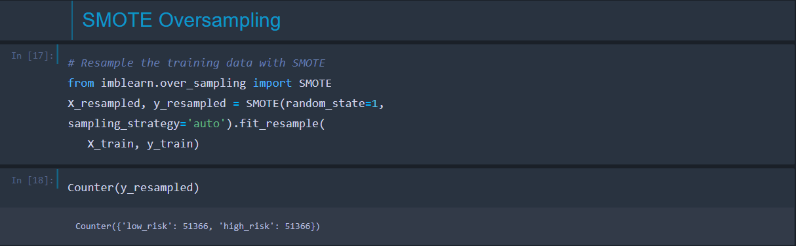
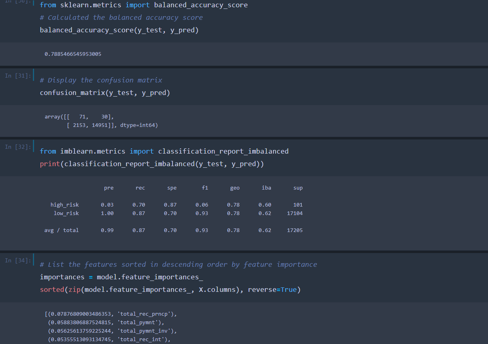
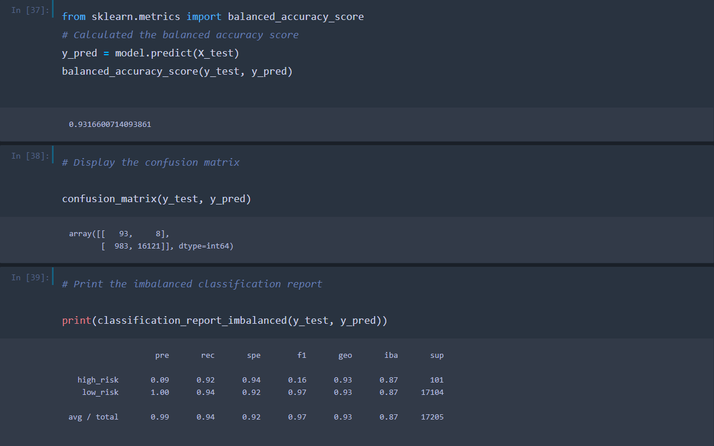

# Credit Risk Analysis

## Overview

**How can we best predict credit risk with machine learning?** 

Credit risk is an inherently unbalanced classification problem, as good loans easily outnumber risky loans.   We will use imbalanced-learn and scikit-learn libraries to build and evaluate models using resampling. In order to predict credit risk, we will oversample(increase the size of the minority class) our data using the RandomOverSampler and SMOTE algorithms, and undersample the data(reduce the size of the majority class) using the ClusterCentroids algorithm. Then we will use a combinatorial approach of over- and undersampling using the SMOTEENN algorithm. We will compare the results using the logistic regression model. Finally, we will compare two machine learning models that reduce bias, BalancedRandomForestClassifier and EasyEnsembleClassifier. 

## Resources
jupyter notebook, imbalanced-learn, scikit_learn , [loan data csv](LoanStats_2019Q1.csv) 

[resampling code](credit_risk_resampling.ipynb) 

[ensemble model code](credit_risk_ensemble.ipynb)

## Results
Results: Using bulleted lists, describe the balanced accuracy scores and the precision and recall scores of all six machine learning models. Use screenshots of your outputs to support your results.

- RandomOverSampler algorithm (oversample) 
    - re-sampled data increases the smaller class' data 

    
    - Fitting this re-sampled data to the logisticRegression model, gives the following accuracy score, confusion matrix/ classification report.

    

- SMOTE algorithm (oversample)
    - re-sampling with SMOTE again increases the smaller (high-risk) class' data

    

   - Again we use the Logistic Regression model. The results are as follows. 

        

- ClusterCentroids algorithm (undersample)
    - re-sampling with Cluster centroids undersamples the larger low-risk class.

    

    - This re-sampled data is fitted to LinearRegression model and we see the following results. 

     

- SMOTEENN algorithm(over and undersampling)
    - re-sampling with SMOTEENN uses a combination approach.

    
    
    - again I used Linear Regression model. The results are as follows. 

    

- BalancedRandomForestClassifier (bias reducing model)
    - The Balanced Random Forest Clasifier model, an ensemble model that utilizes bootstrapping.

    

    - the results can be seen below.  I was also able to see which columns had the greatest influence on outcome.

    

- EasyEnsembleAdaBoostClassifier (bias reducing model)
    - The classifier is an ensemble of learners trained on different balanced bootstrap samples. Balancing is achieved by random under-sampling.

    

    -  the results can be seen below. Note the high accuracy score 0.93

    
    

## Summary

- We can see that our Ensemble models had higher balanced accuracy scores than our first attempts at over/under combination re-sampling. The EasyEnsemble Classifier scoring particularly high.
 - However, sensitivity and precision when predicting the lower case, high risk loans, is a problem.  F1 score illustrates the balance of precision and sensitivity with a score of 1 being perfect. Looking at the classification reports we can see no model does a good job.
 EasyEnsemble does the best, but it still has a low precision score (0.09) which leads to a low,(albeit the best here) F1 score 0.16.
 - This can be further evidenced in the confusion matrix of the best performer where we see 983 false positives(compared to just 93 true positives).
 - **I would conclude that none of these models are good at predicting High-Risk loans.**

 
