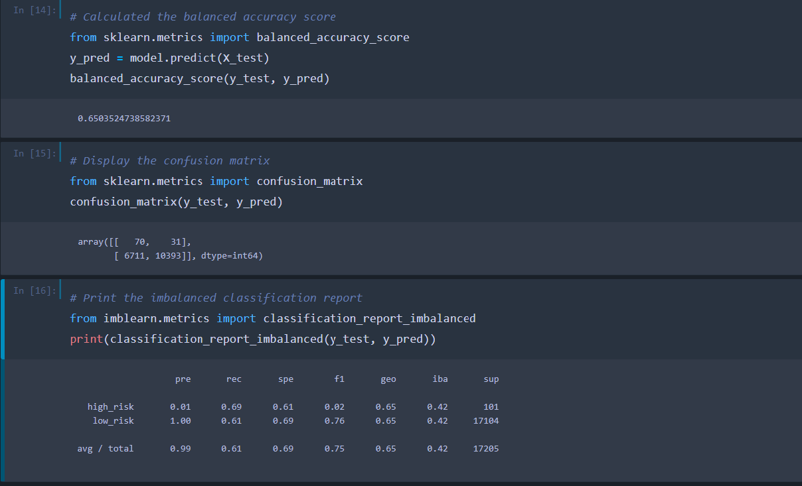

# Credit Risk Analysis

## Overview

*How can we best predict credit risk with machine learning?* 

Credit risk is an inherently unbalanced classification problem, as good loans easily outnumber risky loans.   We will use imbalanced-learn and scikit-learn libraries to build and evaluate models using resampling. In order to predict to credit risk, we will oversample(increase the size of the minority class) our data using the RandomOverSampler and SMOTE algorithms, and undersample the data(reduce the size of the majority class) using the ClusterCentroids algorithm. Then we will use a combinatorial approach of over- and undersampling using the SMOTEENN algorithm. We will compare the results using the logistic regression model. Finally, we will compare two machine learning models that reduce bias, BalancedRandomForestClassifier and EasyEnsembleClassifier. 

## Resources
jupyter notebook, imbalanced-learn, scikit_learn  

## Results
Results: Using bulleted lists, describe the balanced accuracy scores and the precision and recall scores of all six machine learning models. Use screenshots of your outputs to support your results.

- RandomOverSampler algorithm (oversample) 
    - re-sampled data increases the smaller class' data 

    
    - Fitting this re-sampled data to the logisticRegression model, gives accuracy score of 0.65 and the following confusion matrix/ classification report.

    

- SMOTE algorithm (oversample)
    - re-sampling with SMOTE again increases the smaller (high-risk) class' data

    

   - Again we use the Logistic Regression model. The results are as follows.

        

- ClusterCentroids algorithm (undersample)
    - re-sampling with Cluster centroids undersamples the larger low-risk class.

    

    - This re-sampled data is fitted to LinearRegression model and we see the following.

     

- SMOTEENN algorithm(over and undersampling)
    - re-sampling with SMOTEENN uses a combination approach.

    
    
    - again I used Linear Regression model. The results are as follows.

    

- BalancedRandomForestClassifier (bias reducing model)

- EasyEnsembleClassifier (bias reducing model)

## Summary
 Summarize the results of the machine learning models, and include a recommendation on the model to use, if any. If you do not recommend any of the models, justify your reasoning.
